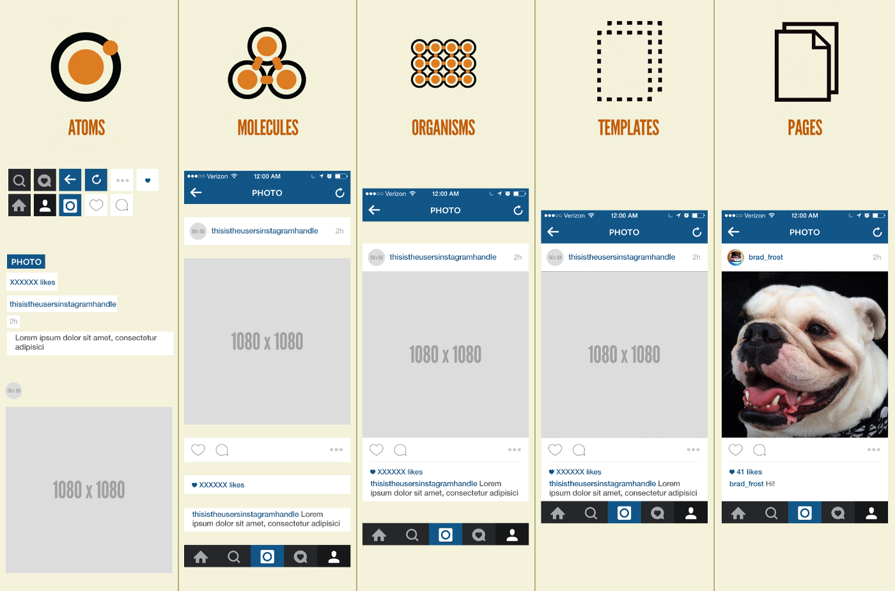

# Guia-React

<details open>
<summary>⚙️ Instalacion de React ⚙️</summary>

1. Primero instala ```NPM```
   - [Link a la pagina web de Node.js](https://nodejs.org/es/) 
   - Descarga la version ```LTS``` (Long Term Support) o (Last Stable version)
2. En la terminal ```CMD``` (Windows + X despues presionamos A) ponemos el siguiente codigo asegurate de estar en la carpeta del proyecto.
    - ```npx create-react-app``` nombreDeNuestroProyecto
3. Como iniciar React
    - En la terminal ponemos el siguiente codigo
    ```npm run start```

    - Tenemos otros escripts pero para probar que funciona utilizaremos este 

</details>

## Folder structure
1. node_modules
   - todo los componentes de node instalados al ejecutar npx 
2. public
   - ```contiene archivos estáticos``` como index. html, archivos de librerías javascript, imágenes, y otros activos, etc. ```que no quieres que sean procesados por webpack```
   - Tambien ```contiene el archivo index.html``` que es el archivo ```donde se renderiza todos nuestros componentes y codigo``` que hemos creador.
3. src 
   - todos los archivos con los que trabajamos y creamos nuestra aplicacion web

## CLASS Y FUNCTION

Function type
```javascript
    function app(){
        return(
            // html component & app 
        )
    }
```
class type 
```javascript
import React from 'react;

    class App extends React.component {
        render(){
            return (
                // html component & app 
            );
        }
    }
```
## CLASS VS HOOKS

## CREATING A COMPONENT 
 1. Creating the component
      - In the ```SRC``` folder whe create a new ```newComponent.js``` file 
 2. Inside the new component file
    - You need to import the react component
        ```javascript
        import react, {component} from 'react;
        ```
    - the component code sintax 
        ```javascript
        class "app name" extends Component {
            render(){
                return (
                    <!-- html compoenent content  -->
                );
            }
        }
        ```
        
 3. The export method
    ```javascript 
    export default appName
    ```
4. Rendering the component
   - In the ```index.js in src folder``` whe need to put our new componet 
    ```javascript 
    ReactDOM.render("Put your new component here" ,document.getElementById('root));
    ```
    - Remenber is a ```Self cosing tag```, javascript will undesrtand it an he would render the new component
    ```html 
    <myNewApp/>
    ```
## ADDING CSS TO THE PROJECT
1. Creating the css file
   - In the ```SRC folder``` I recomend you to create a ```Styles folder``` and then create the ```custom.css``` file.
2. Import the css file to the project/component ```is the same way in both cases```.
   ```javascript 
   impot 'css src path';
   ```
3. Warnings
   - css ```html clases``` in javascript is redered diferent
        ```javascript 
        <div class="main-div"></div> this gives a explorer error on the console
        ```
    - The correct way to do it is ```changin class to className```
        ```javascript
        <div className="main-div"></div>
        ```
## Atomic Desing Methodology


###  ATOMOS
- los átomos de nuestras interfaces ```son los componentes básicos de todas nuestras interfaces de usuario.``` Estos átomos incluyen ```elementos HTML básicos.```


- Cada átomo tiene sus propias ```propiedades únicas```

### MOLECULAS
- Las moléculas ```son grupos relativamente simples de elementos de interfaz de usuario``` que ```funcionan juntos como una unidad.``` Por ejemplo, una etiqueta de formulario, una entrada de búsqueda y un botón ```pueden unirse para crear una molécula de formulario de búsqueda.```
  
- ```Cuando se combinan, estos átomos abstractos de repente tienen un propósito.``` El átomo de etiqueta define ahora el átomo de entrada. Al hacer clic en el átomo de botón, se envía el formulario. ```El resultado es un componente sencillo, portátil y reutilizable que puede colocarse en cualquier lugar``` donde se necesite una función de búsqueda.
  
### ORGANISMOS
- Los organismos ```son componentes relativamente complejos de  IU compuestos por grupos de moléculas y/o átomos y/o otros organismos.``` Estos organismos ```forman secciones diferenciadas de una interfaz.```

- ```Los organismos muestran esos componentes más pequeños y sencillos en acción``` y sirven como patrones distintivos que ```pueden utilizarse una y otra vez.``` El organismo de la cuadrícula de productos puede emplearse en cualquier lugar donde sea necesario mostrar un grupo de productos, desde listados de categorías a resultados de búsqueda o productos relacionados.

### PLANTILLAS
- Las plantillas ```son objetos a nivel de página``` que colocan componentes en un diseño y ```articulan la estructura de contenido``` subyacente del diseño.

### PAGINAS
- Las páginas son ```instancias específicas de plantillas que muestran el aspecto de una interfaz de usuario con contenido representativo real.```