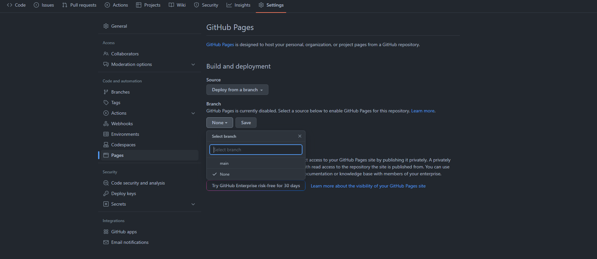

# Guide-React

<details open>
<summary>⚙️ Installing React ⚙️</summary>

1. First install ``NPM``.
   - [Link to Node.js web page](https://nodejs.org/es/) 
   - Download the (Long Term Support) or (Last Stable version)
2. In the terminal ```CMD``` (Windows + X then press A) put the following code make sure you are in the project folder.
    - ```npx create-react-app projectName``` 
3. How to start React
    - In the terminal we put the following code

        ````npm run start````

    - We have other scripts but to test that it works we will use this one 

</details>

## Folder structure
1. node_modules
   - all node components installed when running npx 
2. public
   - ````contains static files```` such as index.html, javascript library files, images, and other assets, etc. ``` that you do not want processed by webpack```.
    - It also ```contains the index.html which is the file ```where all our components and code that we have created are rendered.
3. src 
   - all the files with which we work and create our web application

## CLASS Y FUNCTION

Function type
```javascript
    function app(){
        return(
            // html component & app 
        )
    }
```
class type 
```javascript
import React from 'react;

    class App extends React.component {
        render(){
            return (
                // html component & app 
            );
        }
    }
```
## CLASS VS HOOKS

## CREATING A COMPONENT 
 1. Creating the component
      - In the ```SRC``` folder whe create a new ```newComponent.js``` file ```always start the component name witch unppercase``` 
 2. Inside the new component file
    - You need to import the react component
        ```javascript
        import react from 'react;
        ```
    - the component code sintax 
        ```javascript
        class "AppName" extends Component {
            render(){
                return (
                    <!-- html compoenent content  -->
                );
            }
        }
        ```
        
 3. The export method
    ```javascript 
    export default AppName
    ```
4. Rendering the component
   - In the ```index.js in src folder``` whe need to put our new componet 
    ```javascript 
        const root = ReactDOM.createRoot(document.getElementById('root'));
        root.render(
        <React.StrictMode>
          put your compoenent here this way => <appName/>
        </React.StrictMode>
        );
    ```
    - Remember is a ```Self cosing tag```, javascript will undesrtand it an he would render the new component
    ```html 
    <AppName/>
    ```
## ADDING CSS TO THE PROJECT
1. Creating the css file
   - In the ```SRC folder``` I recomend you to create a ```Styles folder``` and then create the ```custom.css``` file.
2. Import the css file to the project/component ```is the same way in both cases```.
   ```javascript 
   impot 'css src path';
   ```
3. Warnings
   - css ```html clases``` in javascript is redered diferent
        ```javascript 
        <div class="main-div"></div> this gives a explorer error on the console
        ```
    - The correct way to do it is ```changin class to className```
        ```javascript
        <div className="main-div"></div>
        ```
## REACT PROPS
1. Prop is properties of an element in ```app.js```
   ```javascript 
   ReactDOM.render(<miApp customProp = {'This is mi custom properti'}/>)
   ```
2. In the component 
    ```html  
    <div>
        <p>{this.props.customProp}</p>
    </div>
    ```
## REACT DEPLOYMENT TO GITHUB
 1. first install the ```gh-pages``` npm package
    ```shell
    npm install -g gh-pages
    ```
    - Note the -g to make a global installation to use it in other projects not only in this project
 2. In package.json create a home page
    ```json 
        {
          "name": "my-app",
          "version": "0.1.0",
          + "homepage": "https://YourUserName.github.io/yourRepoName", 
          "private": true,
    ```
 3. Create ```create deploy scripts```
    ```json
    "scripts": {
      +   "predeploy": "npm run build",
      +   "deploy": "gh-pages -d build",
          "start": "react-scripts start",
          "build": "react-scripts build",
    ```
4. Ready to deploy
    ```json 
    npm run deploy
    ```
5. github you need to change the gh pages source ```from master``` to ```gh-pages branch```
   
## Atomic Desing Methodology


###  ATOMOS
- los átomos de nuestras interfaces ```son los componentes básicos de todas nuestras interfaces de usuario.``` Estos átomos incluyen ```elementos HTML básicos.```


- Cada átomo tiene sus propias ```propiedades únicas```

### MOLECULAS
- Las moléculas ```son grupos relativamente simples de elementos de interfaz de usuario``` que ```funcionan juntos como una unidad.``` Por ejemplo, una etiqueta de formulario, una entrada de búsqueda y un botón ```pueden unirse para crear una molécula de formulario de búsqueda.```
  
- ```Cuando se combinan, estos átomos abstractos de repente tienen un propósito.``` El átomo de etiqueta define ahora el átomo de entrada. Al hacer clic en el átomo de botón, se envía el formulario. ```El resultado es un componente sencillo, portátil y reutilizable que puede colocarse en cualquier lugar``` donde se necesite una función de búsqueda.
  
### ORGANISMOS
- Los organismos ```son componentes relativamente complejos de  IU compuestos por grupos de moléculas y/o átomos y/o otros organismos.``` Estos organismos ```forman secciones diferenciadas de una interfaz.```

- ```Los organismos muestran esos componentes más pequeños y sencillos en acción``` y sirven como patrones distintivos que ```pueden utilizarse una y otra vez.``` El organismo de la cuadrícula de productos puede emplearse en cualquier lugar donde sea necesario mostrar un grupo de productos, desde listados de categorías a resultados de búsqueda o productos relacionados.

### PLANTILLAS
- Las plantillas ```son objetos a nivel de página``` que colocan componentes en un diseño y ```articulan la estructura de contenido``` subyacente del diseño.

### PAGINAS
- Las páginas son ```instancias específicas de plantillas que muestran el aspecto de una interfaz de usuario con contenido representativo real.```